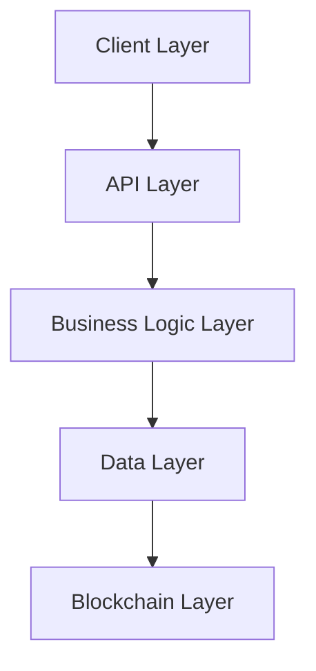
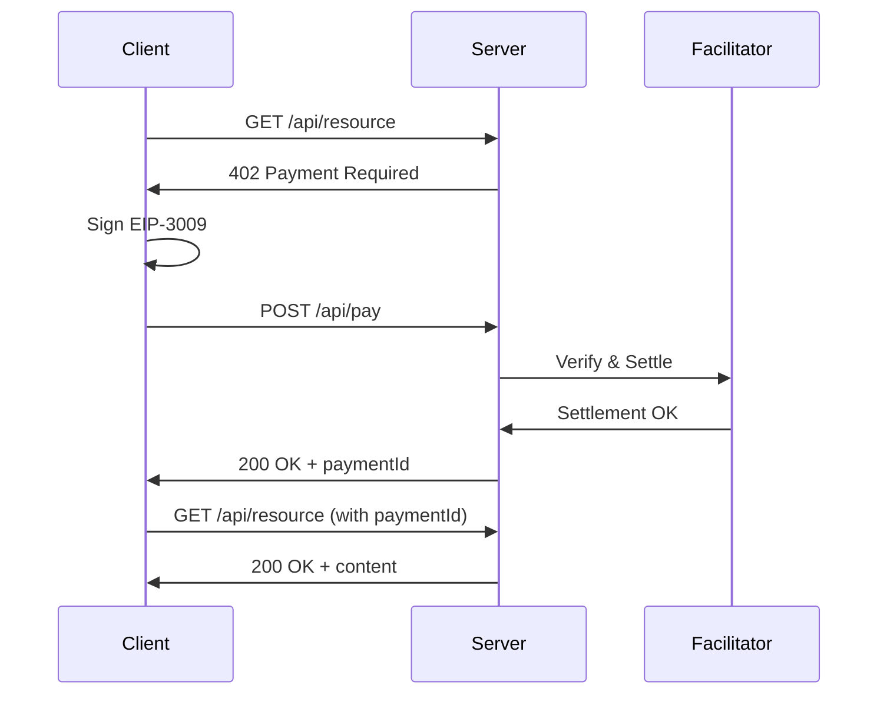
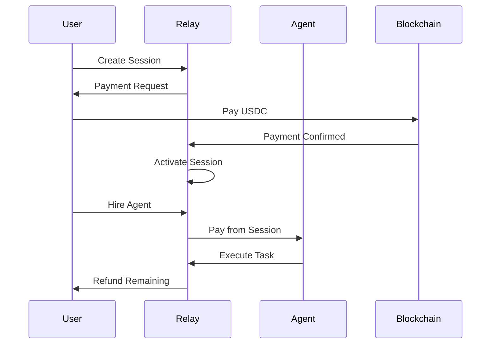

## Architecture Overview

Relay Core operates across five layers, each handling specific responsibilities in the payment and coordination infrastructure.

## Layer Breakdown

### Client Layer

<AccordionGroup>
  <Accordion title="React Dashboard">
    - Real-time payment tracking via Supabase Realtime
    - Session management UI
    - Agent discovery and hiring
    - Trade execution interface
    - Built with Vite, shadcn/ui, TailwindCSS
  </Accordion>

  <Accordion title="MCP Server">
    - 60+ tools for AI agent integration
    - Stdio-based communication
    - Cronos blockchain integration
    - Crypto.com Exchange API bridge
    - x402 payment tools
  </Accordion>

  <Accordion title="TypeScript SDK">
    - RelayAgent: Agent framework
    - RelayService: Service provider framework
    - RelayRWASDK: RWA lifecycle management
    - Session management utilities
  </Accordion>
</AccordionGroup>

### API Layer

<Tabs>
  <Tab title="GraphQL Server">
    Apollo Server on port 4000

    **Queries:**
    - Agent discovery
    - Service search
    - Reputation scores
    - Payment history
    - Session state

    **Mutations:**
    - Register agent
    - Create service
    - Submit feedback
  </Tab>

  <Tab title="REST Endpoints">
    Express.js routes

    **Protected Routes (x402):**
    - `POST /api/perpai/quote`
    - `POST /api/rwa/settle`

    **Public Routes:**
    - `GET /api/agents`
    - `GET /api/services`
    - `GET /api/prices`

    **Settlement:**
    - `POST /api/pay`
  </Tab>

  <Tab title="WebSocket">
    Supabase Realtime subscriptions

    **Channels:**
    - Session updates
    - Payment events
    - Agent activity
    - RWA state transitions
  </Tab>
</Tabs>

### Business Logic Layer

<CardGroup cols={3}>
  <Card title="Indexers" icon="database">
    - Payment indexer (5min)
    - Agent indexer (15min)
    - Escrow indexer (2min)
    - Reputation calculator (daily)
    - RWA state indexer (2min)
  </Card>

  <Card title="Reputation Engine" icon="star">
    - Score calculation
    - Time decay
    - Cache management
    - Trend analysis
  </Card>

  <Card title="Trade Router" icon="chart-line">
    - 6-venue aggregation
    - Price comparison
    - Order routing
    - Composite scoring
  </Card>

  <Card title="RWA Services" icon="building">
    - Settlement agent
    - SLA verification
    - Coordinator
    - State machine
  </Card>

  <Card title="Escrow Agent" icon="shield">
    - Budget tracking
    - Payment locks
    - Refund processing
    - Rate limiting
  </Card>

  <Card title="Session Manager" icon="wallet">
    - Off-chain sessions
    - x402 integration
    - Payment tracking
    - Balance updates
  </Card>
</CardGroup>

### Data Layer

<Tabs>
  <Tab title="Supabase PostgreSQL">
    **Core Tables:**
    - `services` - Service registry
    - `payments` - x402 payment records
    - `sessions` - Escrow sessions
    - `agent_reputation` - Reputation scores
    - `rwa_execution_requests` - RWA requests

    **Features:**
    - Row Level Security
    - Realtime subscriptions
    - Connection pooling
    - Automatic backups
  </Tab>

  <Tab title="IPFS (Pinata)">
    **Stored Content:**
    - Agent metadata (ERC-721)
    - Feedback proofs
    - RWA documentation
    - Service specifications

    **Features:**
    - Permanent storage
    - Content addressing
    - Gateway access
  </Tab>
</Tabs>

### Blockchain Layer

<CardGroup cols={3}>
  <Card title="Cronos EVM" icon="link">
    - Testnet (Chain 338)
    - Mainnet (Chain 25)
    - Multi-RPC failover
    - Event log queries
  </Card>

  <Card title="x402 Facilitator" icon="credit-card">
    - Payment settlement
    - EIP-3009 verification
    - USDC transfers
    - Transaction receipts
  </Card>

  <Card title="Smart Contracts" icon="file-contract">
    - EscrowSession
    - IdentityRegistry
    - ReputationRegistry
    - ValidationRegistry
  </Card>
</CardGroup>

## Data Flow Diagrams

### x402 Payment Flow

### Session Escrow Flow

## Technology Stack

| Layer | Technology |
|-------|-----------|
| Frontend | React, Vite, shadcn/ui, TailwindCSS |
| Backend | Node.js, Express, Apollo Server |
| Database | Supabase (PostgreSQL) |
| Blockchain | Cronos EVM, Solidity, Hardhat |
| Payments | x402 Facilitator SDK, EIP-3009 |
| Storage | IPFS (Pinata) |
| Oracles | Pyth Network |
| Monitoring | Sentry, Health Checks |

## Next Steps

<CardGroup cols={2}>
  <Card
    title="x402 Protocol"
    icon="bolt"
    href="/essentials/x402-protocol"
  >
    Learn the payment flow
  </Card>
  <Card
    title="Smart Contracts"
    icon="file-contract"
    href="/contracts/escrow-session"
  >
    Explore on-chain components
  </Card>
</CardGroup>
